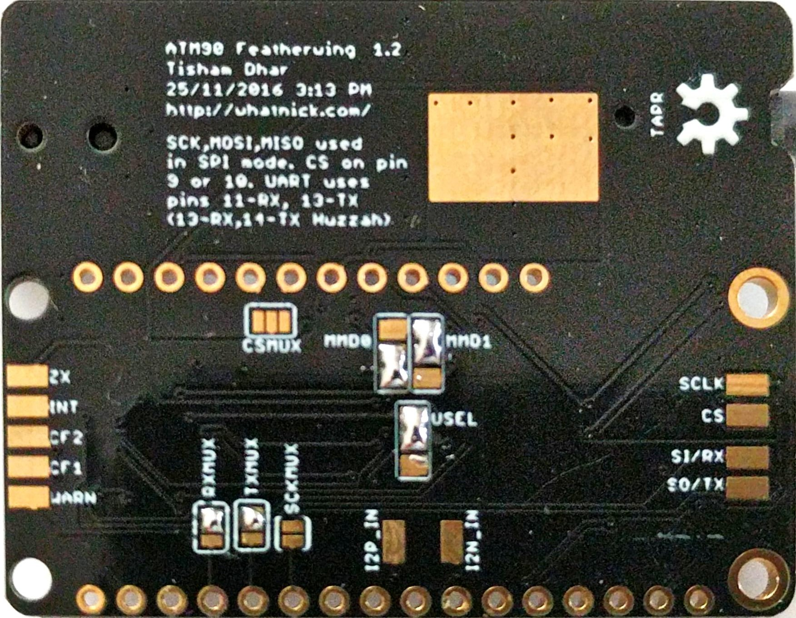
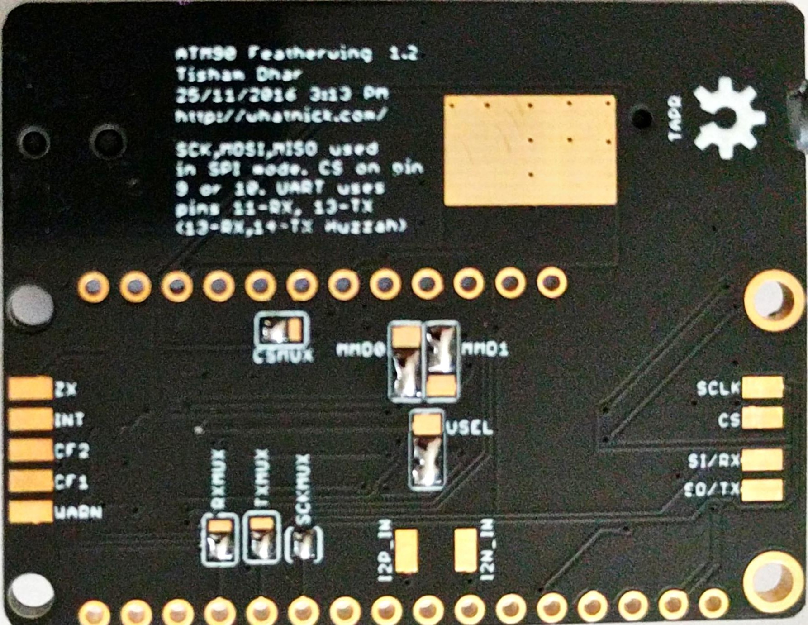
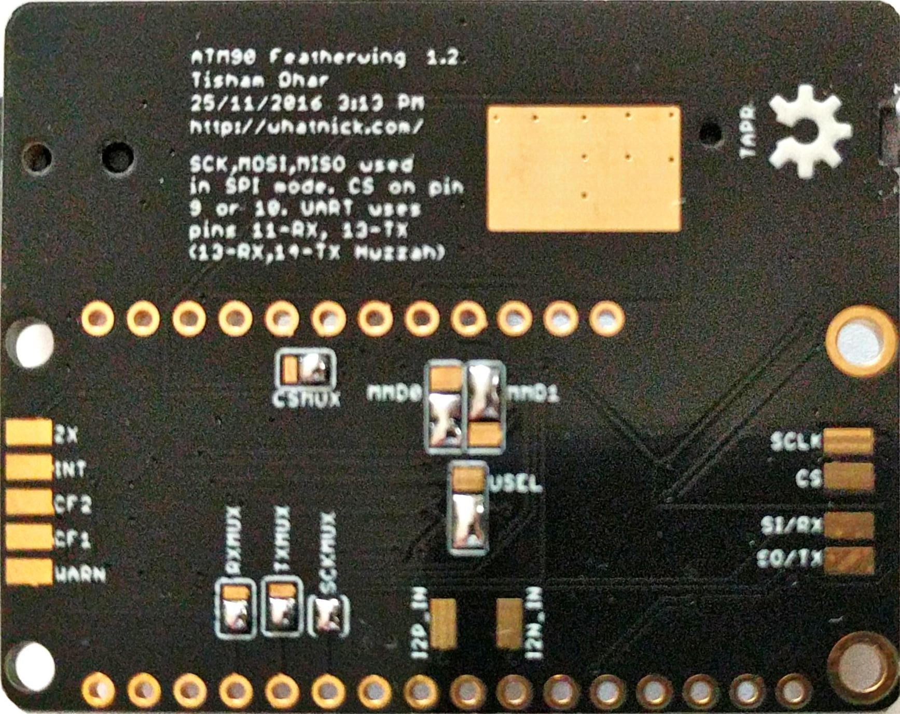

# ATM90E26_Featherwing_KiCAD
ATM90E26 Featherwing with ongoing development in KiCAD
- Previous Eagle version available here: https://github.com/whatnick/ATM90E26_Featherwing
- Arduino Library is available here: https://github.com/whatnick/ATM90E26_Arduino
- Micropython Library is available here: https://github.com/whatnick/ATM90E26_Micropython

# Connection to Host CPU
The boards can be connected in 2 ways with different corresponding jumper settings underneath the board:

- UART mode (default mode)

- SPI mode (requires resoldering of jumpers)
    - With CS on pin 9 
    - With CS on pin 10 

# Metering  modes
Using the MMD jumper various metering modes can be selected as specified by the datasheets.

# Connection to Voltage/Current samplers

The ATM90E26 can acquire 1 voltage and 2 current waveforms to perform energy measurement.
- Voltage sampling using step-down transformer (9V-12V) and voltage divider
- Current sampling using CT with multiplier resistor

# Licence Details
- Hardware License: TAPR 1.0
- Software License: MIT
- Documentation License: CC BY 4.0 International
